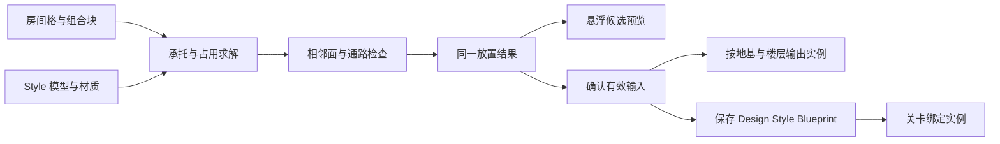

# 生成逻辑与代码结构

本文说明当前实现如何把“有意义的建筑块”转成实例几何。修改规则时，应同时保护编辑预览、最终生成、保存重开和关联实例，而不只是让一个示例看起来正确。

最初的交互灵感来自 [Oskar Stålberg 的 Brick Block](https://oskarstalberg.com/game/house/index.html)（`house` 页面）：通过增减格子搭建房屋，并让邻接外观随输入更新。以下承托、占用、门窗、楼梯、组合块及保存规则是本项目面向 Unreal 场景制作编写的独立实现，未移植或收录原作代码与资源；本章描述的是本插件的实现，不推断原网页使用的底层算法。[作者官网](https://oskarstalberg.com/)。

## 制作输入和输出

一栋建筑主要有三类制作输入：

| 输入 | 职责 | 主要类型 |
|---|---|---|
| 房间格及门窗覆盖 | 哪些位置有房间，哪些外露面有门窗 | `Cells`、`FDesertRoomAppearance` |
| 有语义的组合块 | 棚亭、瓦罐、篷布、楼梯、散石、墙冠的位置与朝向 | `FDesertBlockPlacement` |
| 美术配置 | 每种角色使用的模型、材质和变体数组 | `UDesertBuildingStyle` |

`UDesertBuildingDesign` 保存这些输入、尺寸和 Seed，并链接一份可拖入关卡的建筑蓝图。`ADesertBuilding` 使用这些输入产生组件和实例。一次保存不会把生成规则删掉，也不会把建筑变成只能整体渲染的一件网格。

## 坐标不是模型外形

房格使用整数坐标 `(X,Y,Z)`。默认横向格宽 `CellSize=300 cm`，竖向层高 `FloorHeight=300 cm`。第一个房间底面在 Z=0，首层屋顶表面在 Z=1；楼梯使用目标屋顶的表面坐标。

房格的底面中心由 `(X+0.5, Y+0.5)` 乘格宽得到。墙片从房格四面计算位置与旋转。因此整数格 `(0,0,0)` 的底面中心并非建筑 Actor 局部原点。

所有方向遵守建筑局部坐标：`Facing=0` 为前 `-Y`，1 为右 `+X`，2 为后 `+Y`，3 为左 `-X`。模型可不规则，模块占用和连接规则仍必须有可重复的坐标约定。

## 房间承托先求解

`ResolveSupportedCells` 先按高度处理房间。正下方有效房间提供直接承托；缺少下层时，开启 `bAutoSupportColumns` 可以尝试四角支柱。

支柱先寻找本栋建筑的较低屋面，再向场景地面检测。只接受可承托的朝上表面，不把墙侧面当成地面。四角必须全部成功；最大柱高和射线距离也受限制。当前自动支撑要求建筑竖直，只允许绕 Z 旋转。

原始输入和有效输出分开保存。旧数据中的不合法输入可以留作诊断，但不产生几何。交互设计器新增时会先校验，无效点击不写入数组，避免用户后来加支撑时突然出现以前没显示的楼梯。

## 墙和屋顶由邻居决定

生成器将有效房格放入集合，检查四个横向邻格。相邻有房间时不生成那面外墙；顶部有房间时不是外露屋顶；两块露台之间不生成内部女儿墙。

门窗覆盖仅作用于外露面。门墙优先于同面的窗墙；共享内部面不被门窗覆盖重新变成一面隔墙。自动入口与显式入口也要检查门前通路。

几何衔接使用两套不同规则：

1. **墙端让位**：完整墙、左端／右端／两端让位模型配合，保持名义 300 cm 原点。让位模型削去指定端部 20 cm，洞口位置不跟着重新缩放。
2. **外露凸角软化**：角点周围同层四格只有本格占用时，才选择对应的外角小圆角模型。直拼、凹角和对角接触保留原接面。

这些规则选择模型并摆放实例，不做运行时 Boolean、自动焊接或任意连续网格变形。模型作者仍需保护连接端截面、法线和材质尺度。大斜切若削掉共享接边，再准确的格坐标也不能补回孔洞。

`RoomCellMesh` 是另一条快捷路线：一件整房模型代替墙片、楼板和屋顶。它自身的内部面、门窗和顶面由美术作者负责，当前插件不会自动切掉整房模型的公共面或屋顶楼梯入口。需要可靠可变拼接时优先使用墙片套件。

## 附件规则

| 组合块 | 必要条件与当前限制 |
|---|---|
| 屋顶棚亭 | 有效裸露屋顶 |
| 穹顶 | 有效屋顶，或正下方有效棚亭的顶部 |
| 斜顶墙冠 | 有效裸露屋顶，Style 必须有对应模型；参与空间检查 |
| 瓦罐组 | 裸露屋顶或首层外墙外围地面；自动位置靠墙／屋顶边并避开门与楼梯出口 |
| 篷布＋支架 | 恰好一面首层邻墙，背面朝墙；后缘贴墙、最低点贴地，四角地面高差不超过 10 cm |
| 楼梯 | 有效目标露台和外露出口；整条通路、平台、尺寸与地面承托合法 |
| 外围散石 | 首层外墙外围地面，避开门和楼梯，四角近似平整；手动整组放置 |

组合块不仅检查锚点是否相同，还检查实际包围盒与通路区域。默认同一表面格不能占多个组合块。外侧非旧版朝外楼梯和内侧屋顶棚亭可以共享锚点，但仍要通过不重叠检查；这不是所有类型可自由叠放的通用例外。

楼梯的 L 形通路使用分段空间，不能用覆盖整个 L 外框的大盒子误占内侧空区域。现代固定 L／U 模型仅支持一层高度。检查合同使用模型实际级数、净宽、踏深，约束级高不超过 22 cm、净宽至少 80 cm、踏深至少 22 cm；这些数值是工具的制作规则，不是对现实建筑法规合规性的声明。

## 稳定随机与整组变体

篷布、瓦罐和屋顶装饰变体由 `Seed` 与格坐标计算。结果不依赖数组中的放置条目序号，因此添加另一个格、删除别的模块或转动 Facing，不应让同一位置随意更换模型。

`VariantIndex=-1` 表示自动选择；非负下标指定具体完整组合。空数组时，部分角色可以保留旧单模型或基础几何；非空数组里的空槽、越界索引要明确拒绝，不能随机找另一项掩盖配置错误。

瓦罐位置另由 `PotPlacement` 决定。`Automatic` 和九方向选项移动完整罐组，按实际包围盒留缝并保护通路。历史未存该字段的素材维持 `LegacyCentered=0`，升级不悄悄移动旧罐组。

## 预览与确认共用结果

`EvaluatePlacement` 返回 `FDesertPlacementCheck`，其中包含：允许状态、原因、局部包围盒、支柱、最终变换、模型、变体下标和级数。预览使用这个结果画候选模块；`TryAddPlacement` 通过同一逻辑确认输入。

规则不能仅在界面里写一套“绿色判断”，生成器里再写另一套。尤其篷布贴墙偏移、实际最低点对地和变体选择，必须使用同一次求解输出，否则绿色候选与点击后的模型会跳动。

删除使用 `RemovePlacementAndDependents`，一并处理失去承托或冲突的依赖模块。旧无效输入可以通过 `RemoveInvalidAuthoringEntries` 清理。界面操作包在虚幻撤销事务里。

## 分层、碰撞与遮挡淡化

同种网格／材质在同一层使用 `UInstancedStaticMeshComponent` 输出；不同层有独立组件。地基及地基环境组独立于楼层，附件也归入相应结构层。

结构墙、屋顶、地基、支柱与楼梯组件提供碰撞；布、木装饰、陶罐装饰和散石等默认有各自的非阻挡策略。实际洞口通行仍依赖模型碰撞的正确性：给窗墙或门墙一整个凸盒会封死洞口。当前组件默认不自动影响导航，需要项目另外验证和配置 NavMesh。

遮挡接口提供：

| API | 含义 |
|---|---|
| `GetFoundationComponents()` | 地基组实际组件 |
| `GetFloorComponents(FloorIndex)` | 指定楼层实际组件，楼层从 1 起 |
| `GetFloorIndexForComponent(Component)` | 0 地基、1…楼层、-1 不属于本栋 |
| `SetOcclusionFade(VisibleAmount)` | 整栋上部淡化，地基排除 |
| `SetFloorOcclusionFade(FloorIndex, VisibleAmount)` | 指定层淡化 |
| `RestoreAllOcclusionFade()` | 恢复显示 |

`VisibleAmount=1` 完全显示，0 完全淡出。材质必须实现 `OcclusionFade` 或 Actor 指定的同名标量参数，才能产生视觉变化。插件没有替项目实现摄像机遮挡检测，也不因视觉淡化而自动改变碰撞。

## 保存、修订与关卡加载

保存输入后增加 Design 修订，更新配套蓝图默认对象，并同步当前已打开关卡中引用同一 Design 的建筑。其他关卡打开时，Editor 模块检查 `AppliedDesignRevision` 与 Design 修订；不同则更新，关卡需要再次保存。

加载已有地图时会保留已保存实例，避免地图加载阶段地面碰撞尚未就绪就重新探地，导致几何丢失。第一次拖入建筑蓝图时启用生成。游戏开始时仍有修订不同的兜底路径，所以不要理解为运行时类型完全没有生成代码；主要工作流是编辑完成后保存场景。

“复制为静态实例快照”复制组件与实例，保留原件，不合并网格，不复制生成与淡化接口。想继续参数化编辑应使用保存的 Design／BP，不以快照替代。

## 主要代码入口

| 文件 | 适合查看或修改的内容 |
|---|---|
| [DesertBuilding.h](../Source/DesertBuildingLab/DesertBuilding.h) | 公共输入、结构及淡化 API |
| [DesertBuilding.cpp](../Source/DesertBuildingLab/DesertBuilding.cpp) | 墙、屋顶、组件、实例与重建 |
| [DesertBuildingBlocks.cpp](../Source/DesertBuildingLab/DesertBuildingBlocks.cpp) | 支撑、附件、空间检查、预览校验与删除 |
| [DesertBuildingRoomAppearance.cpp](../Source/DesertBuildingLab/DesertBuildingRoomAppearance.cpp) | 逐房门窗 |
| [DesertBuildingStyle.h](../Source/DesertBuildingLab/DesertBuildingStyle.h) | 模型合同、变体与材质替换槽 |
| [DesertBuildingDesign.h](../Source/DesertBuildingLab/DesertBuildingDesign.h) | 持久制作数据与格式字段 |
| [DesertBuildingDesigner.cpp](../Source/DesertBuildingLabEditor/DesertBuildingDesigner.cpp) | Slate 界面、相机、操作和状态提示 |
| [DesertBuildingDesignAssets.cpp](../Source/DesertBuildingLabEditor/DesertBuildingDesignAssets.cpp) | Design／Style／BP 保存与同步 |
| [DesertBuildingAssetCollection.cpp](../Source/DesertBuildingLabEditor/DesertBuildingAssetCollection.cpp) | 美术依赖闭包、分类复制、引用重映射 |

扩展新组合块时，至少检查类型定义、Style 槽、尺寸／原点合同、占用、承托、预览配方、组件归层、碰撞、保存与重开。增加公开字段应给旧资产稳定默认值；不要把新组件插入旧楼层模板序列中导致已有下标改变。
