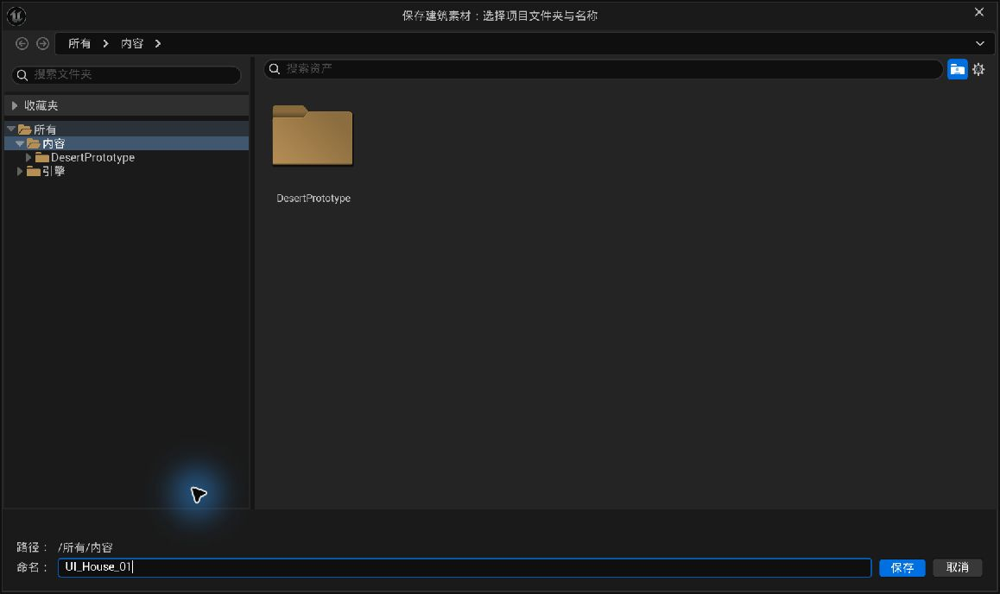

# 操作指南：从安装到一栋可修改的建筑

本文对应 `0.4.9-ui.1`，包含0.4.8相邻层楼梯、点缀与门槛修复。先完成一栋小建筑，再增加附件和美术细节，会更容易判断是哪一项规则阻止了放置。

## 1. 安装到已有项目

1. 保存项目和当前关卡，关闭虚幻编辑器。
2. 在 `.uproject` 所在文件夹内创建 `Plugins` 文件夹。
3. 将本仓库放入 `Plugins/DesertBuildingLab`。检查 `DesertBuildingLab.uplugin` 直接位于这个文件夹中，不要出现 `DesertBuildingLab/DesertBuildingLab/DesertBuildingLab.uplugin`。
4. 源码版需要可用的 Unreal C++ 编译环境。已能编译的 C++ 项目可以直接使用其现有工具链；纯蓝图项目可先通过虚幻的“新建 C++ 类”流程建立项目编译文件，然后保存、关闭编辑器再安装插件。
5. 重新生成项目文件，打开项目解决方案，编译项目的 **Editor** 目标，配置通常为 `Development Editor`、`Win64`。不要把插件的 Editor 模块当成独立游戏运行目标。
6. 打开项目，在“编辑 → 插件”里搜索 **Desert Building Lab** 并启用；按编辑器提示重启。
7. 打开 **工具 → 沙漠建筑工具 → 打开建筑设计器（点击格子搭建）**。

源码文件、插件名和两份模块目录应保持一致。新项目接入尚未在每种项目配置上完成验收；出现模块加载失败时，先看编译输出里的第一条实际错误，再检查目录是否多套了一层。

## 2. 安装可选建筑样例

仓库中的 `Examples` 是项目 Content，不是插件默认 Content。它包含一栋可编辑的 ExampleHouse、完整 Style 和局部化美术依赖；源码工具也可以只使用你自己的资源。

1. 按第 1 节装好并编译插件，关闭虚幻编辑器。
2. 找到仓库里的 `Examples/Content/DesertBuildingLabOpenSource` 文件夹。
3. 将这个文件夹整个复制到项目的 `Content` 中，结果应为 `YourProject/Content/DesertBuildingLabOpenSource`。
4. 保留 `DesertBuildingLabOpenSource` 名称和内部 `Buildings`、`Resources` 层级。不要只复制单个 `.uasset`，不要在资源管理器里重命名内部目录；这些文件按固定 Unreal 包路径引用彼此。
5. 打开项目，等模型和材质加载／编译完成。
6. 展开右栏“高级：资源槽与美术风格”，在 Style 选择器中搜索 `DA_ExampleHouse_Style` 并选择它。其完整路径为 `/Game/DesertBuildingLabOpenSource/Buildings/ExampleHouse/Styles/DA_ExampleHouse_Style`。
7. 要直接看样例建筑，可以“载入建筑素材…”选择 `DA_ExampleHouse`，或从内容浏览器拖入 `DesertBuildingLabOpenSource/Buildings/ExampleHouse/Blueprints/BP_ExampleHouse`。
8. 放入你的关卡后，重新检查地面支撑并保存关卡。示例中检查通过的地面和光照不能替代你的实际场景。

如果同名目标目录已经存在，先核对其是否就是这份样例及是否有你的修改，不要直接覆盖。想在新的管理目录做自己的建筑，载入样例后用“另存变体…”选择新根目录与新名称。

公开版木材使用自制贴图，外观与私有开发版的 Adobe 材质比较结果不同。篷布颜色贴图包含明确标注的 AI 辅助资源；制作来源和许可见[来源说明](美术来源与发布范围.md)与[美术许可](../ASSET_LICENSE.md)。不需要重新购买开发阶段测试过的第三方材质才能加载公开样例。

## 3. 使用自己的持久 Style

`Style` 是“这栋建筑用什么模型和材质”的配置资产，不是格子布局。设计器会将选中的 Style 复制到草稿，修改草稿后再保存建筑。

如果安装包带有可用的风格配置，展开右栏“高级：资源槽与美术风格”，在 Style 选择器中选择它。若仅安装源码，先制作一份自己的配置：

1. 在内容浏览器创建目录，如 `Content/BuildingArt`。
2. 右键 →“杂项／Miscellaneous → 数据资产／Data Asset”，选择 **DesertBuildingStyle**。
3. 命名 `DA_MyBuildingStyle`，双击打开。
4. 最简单的功能验证可以暂时留空模型槽，让生成器使用基础几何；但请为墙、边缘、木材、暗部、篷布、地基、陶土等材质角色指定已保存的材质或材质实例。可以先用项目内简单的单色材质。
5. 保存 Style 和材质，再回到设计器载入 `DA_MyBuildingStyle`。

留空槽位的基础几何是测试入口。最终效果取决于导入的模型与材质。某些槽位有严格例外：例如斜顶墙冠没有模型就拒绝生成；启用墙端规则后缺少端版会提示并显示对应的基础让位几何。不要把所有警告都理解为“没关系，自动找个别的模型”。

## 4. 认识界面、模式和两个预览

先看 [README 的当前设计器截图](../README.md#当前设计器界面)。0.4.9两张图是真实 Slate 截图，采用原工程Art09美术，外观可能与公开替代木材不同；README另保留0.4.1历史实拍，不能按旧侧栏定位当前按钮。

| 分区 | 用途 |
|---|---|
| 顶栏 | 新建、载入、保存／保存更新、另存变体、场景操作、撤销／重做；`* 未保存`表示草稿有改动 |
| 左栏 | 结构／装饰模块分类、真实组合的独立三维预览和缩略图 |
| 中央 | 建筑编辑视口，模式、高度Z、旋转90°、居中与相机速度 |
| 右栏 | 固定建筑规则、当前对象参数、折叠的高级资源槽 |
| 底部 | 当前格、模式和合法／拒绝原因 |

小三维窗显示组合形状与材质，大视口检查实际落点；缩略图不能证明某个位置可放。模型尚在编译时，小预览等待并在完成后刷新。

| 模式 | 左键行为 |
|---|---|
| 放置 | 绿色候选确认新增；红色候选不写入隐藏输入。点已有房间或瓦罐自动切到选择 |
| 选择 | 自动识别房间、附件、点缀；同格共存优先当前工具类型。点击空单元格只清除选择 |
| 删除 | 删除当前类型和失去承托的依赖，可撤销；先核对类型和高度 |

右栏“正在编辑 (x,y,z)”作用于已有对象；“新放置默认”只影响下一次放置。选中附件后更改变体、梯型或朝向会原位校验，不合法时保留原模型。切回“放置”清除全部选择，避免暗改旧块。内部0／1／2是模式编号，不是新增数字快捷键。

| 操作 | 行为 |
|---|---|
| Shift＋左键／Delete | 保留原删除操作，按当前类型处理 |
| 右键＋WASD／Q、E | 前后左右／下降上升 |
| 右键＋鼠标转向／滚轮 | 转向／调相机速度；导航时暂停放置 |
| Alt＋鼠标 | 虚幻式环绕 |
| F／“居中 F” | 居中 |
| 顶栏撤销／重做 | 当前草稿连续编辑，不跨越载入／新建或场景操作 |

设计器撤销不清空或拦截其他UE窗口的全局历史；其他操作回对应编辑器处理。恢复后参数与小预览读回实际数据，对象不存在时清选择。

顶栏“新建”创建空白草稿。更换未保存内容前有提示，关闭编辑器前应保存或另存。

## 5. 搭第一层和第二层

1. 顶栏“新建”，左栏选“房间”，中央选“放置”，高度Z设为 `0`，在相邻地面格放两间房。
2. 看两间房的公共边：墙片路线会隐藏内部墙，屋顶中间不会有两段相互覆盖的女儿墙。
3. 把编辑层设为 `1`，在其中一间上方点击放第二层房间。这里的 `1` 指第二层房间的底面，不是“第一层楼”的名称。
4. 若下方没有房间，查看右栏“建筑规则 → 自动生成四角支柱”。开启时查找下层屋面或场景地面，找不到全部四角承托就拒绝。

新建默认开启；载入保留作者保存值。关闭时出现黄色提示，可点“开启自动支柱”恢复。关闭会让现有房间、附件或门窗失效时拒绝，先补下层房间或删除依赖。四根柱链可分层分段，段数不等于角柱数；制作平面不是实际关卡地面，放入场景后仍需检查。

默认格宽与层高均为 300 cm。房格当前代码范围为 X、Y 各 `-3…3`、Z 为 `0…4`；侧栏允许选择更高编辑平面不代表那里一定可以放房间。

## 6. 改门与窗

1. 选择已有房间，或用房间放置工具点击已有房间切到选择。
2. 在右侧“正在编辑”的房间参数选门：自动、无门、前、右、后、左。
3. 启用窗位覆盖，再勾选四面的窗。
4. 看主预览和状态提示。门窗只出现在外露墙面；相邻房间之间不创建隔墙，不能在共享内部面强行指定门。

方向是建筑局部方向：前 `-Y`、右 `+X`、后 `+Y`、左 `-X`。转动整个建筑 Actor 后，方向跟随建筑一起转。门所在面优先使用门墙，不能要求同一个墙片同时套两种洞口模型。

上层有效外门自动补真实门槛，顶面与室内地板同高、厚度向下。门外有同高露台时处理矮墙开口和点缀避让，无露台则不生悬空平台。这是几何修复，不在材质中找开关；实际角色通行仍需检查。

## 7. 添加相邻楼层楼梯

新梯的格坐标是**上方目标屋顶表面**，每座连接一层。目标Z=k时连接 `(k−1)×层高 → k×层高`；Z=1底部仍检测实际地面。

| 高度Z | 新楼梯连接 |
|---|---|
| 0 | 不是有效终点，先建房间与屋顶 |
| 1 | 地面 → 第一层屋顶 |
| 2 | 第一层屋顶 → 第二层屋顶 |
| 3 | 第二层屋顶 → 第三层屋顶 |

先练习屋顶到屋顶：

1. 在Z=0铺较大底座，例如3×3或更宽，留足楼梯承托空间。
2. 在Z=1底座一侧放房间，其顶部是目标Z=2；外侧留连续的低层屋顶。
3. 左栏选“楼梯 + 平台”，右栏选贴墙直梯、L形或U形，朝外直梯仍保留供对照。
4. 中央设高度Z=2并旋转，在上层目标屋顶格悬浮，出口朝向外露边。
5. 阅读起终点、通路和支撑；绿色再确认，之后保存。

高层每跑、转角平台、后半跑及最低入口前80 cm落脚区必须有**本栋同高连续屋顶**承托。80 cm是空间检查，不是向空中补出的平台。缺格、头顶被堵、出口被同高邻房封住时拒绝；远处地面不代替高层屋顶。L形内空区按分段路径处理，不必填满整个外框。

删承托房间会移除依赖梯，可撤销。选已有梯可原位改梯型／朝向，非法修改保留原梯。固定L／U仍只跨一层，修改假想级数不会改静态模型。

旧连接语义保留，不升级后自动搬梯；需要相邻层连接时明确删除并在新目标表面重放。旧折返只供读取，不是新建选项；显式转现代U形可撤销并重新校验。

## 8. 添加篷布、瓦罐与屋顶组合

**篷布＋支架：**选择外围地面格，调整朝向，让背面朝向房屋。当前规则需要恰好一面首层邻墙；两面墙夹角不符合这条规则。模型实际后缘会贴到墙面，实际最低点会对地面。四角地面高差超过 10 cm 或下面有空洞，会拒绝整组放置。先选一个明确变体，再替换该变体的模型；自动模式用于按 Seed 和坐标稳定选择完整组合。

**瓦罐组合：**可放在裸露屋顶，或与首层外墙相邻的地面。默认使用“自动靠墙／屋顶边”，同时避开门前通路和楼梯出口。也可以选前、右前、右、右后、后、左后、左、左前、中心，共九个方向，方向随 Facing 转动。点已有瓦罐组可以改变整组位置。它移动一整组，不是逐只自动排布。

**屋顶棚亭、穹顶、斜顶墙冠：**棚亭和墙冠需要裸露屋顶，穹顶可以使用屋顶或下方棚亭顶部。墙冠需要自己的模型，不会回退成棚亭。

**手工屋顶点缀：**左栏选“屋顶点缀”，高度设目标表面（一层屋顶Z=1）。右栏可选木板平台、木板与陶罐、角落罐组、双角罐组、沿边三组、小木台与角罐。放置模式同格点击替换，不重复叠加；选择模式原位换方案与旋转。Shift＋左键／Delete只删点缀，保留承托房间。

六种是现有资源的配方，不是六套新模型。它独立保存、不占建筑格；首次非法点击拒绝。已有点缀被房间、合法附件、开口、门前露台或梯路覆盖时暂时隐藏并保留，恢复安全屋顶后可重现。这与“首次无效输入不保存”不同。

**原全屋自动屋顶装饰：**仍可固定或按格随机，不是手工点缀的前置开关。手工组优先同格自动组；删手工后自动组可能恢复。想留空屋顶时删手工并关闭全屋自动装饰，结构楼板保留。

**外围散石：**是手动放置的整组模型，放在首层外墙外围，避开门和楼梯。当前没有逐颗石头适应地形的自动散布器。

## 9. 保存并放入场景

下图是 **V3 阶段标准保存对话框的历史实拍**，用于认识目录选择与命名操作。当前插件会按本文的 `Buildings/Resources` 规范整理输出，不能按旧图判断最终资产位置。

V3 历史 UI 实拍：标准保存窗口的目录和名称选择。当前保存的 `Buildings/Resources` 子目录与更新规则以以下文字和[资产保存规范](AssetOrganization.md)为准。

1. 确认主视窗下方没有无效输入；旧草稿可使用“清理旧的无效条目”。
2. 首次点顶栏“保存…”，或“另存变体…”选择独立素材。
3. 选择项目 Content 中的管理目录，如 `MyVillage`，名称输入 `House01`。
4. 保存后，在 `MyVillage/Buildings/House01/Blueprints` 找到 `BP_House01`，拖入关卡；也可点顶栏“放入场景”。需先命名且无未保存改动，否则先保存。
5. 用虚幻正常的移动／旋转工具摆放建筑，保存关卡。
6. 在目标地形上点击“重新检查规则与地面支撑”。独立预览里的平地有效，不代表目标场景的坡地或空洞也有效。

地基默认向建筑底面下方延伸，`FoundationDepth` 控制深度；它不会自动贴合起伏地形。支柱会探测承托地面，但不允许任意倾斜的建筑，当前支撑逻辑只接受竖直且绕 Z 旋转的建筑。

## 10. 修改和复制

要同时修改使用同一素材的建筑：在设计器载入 `DA_House01`，或从顶栏“载入”菜单载入场景选中的建筑，编辑后点击“保存更新”。已打开关卡里的绑定对象会同步；其他关卡打开时检查修订并更新，之后要保存相应关卡。

要创建另一种布局：载入旧素材后“另存变体…”，如 `House01_Market`。不要用“保存更新”期待得到独立素材。

同一管理目录的变体通常共用 `Resources` 中的美术资源。若只希望一个变体换颜色，先复制材质实例，在那个变体的 Style 中改引用。修改材质后应先保存材质，摆放后应保存关卡；保存建筑并不替代这两步。

## 11. 常见情况

| 情况 | 先检查什么 |
|---|---|
| 悬空房间不生柱 | 右侧建筑规则是否关闭；点恢复按钮，再检查四角承托 |
| 参数改到旧块 | 是否标“正在编辑”；切“放置”清选择，再设下次默认 |
| 高层楼梯拒绝 | 目标表面Z、下层跑道／平台／入口80 cm的连续承托、头顶与出口 |
| 删点缀又出现木板 | 全屋自动装饰仍开启，手工删除后自动组恢复 |
| 空单元格显示红色 | 主视窗下方的拒绝原因、类型、编辑层、朝向、地面支撑 |
| 左键删除不了某个附件 | 切到该附件的工具；删除按当前类型生效 |
| 整房槽为空 | 墙片套件可正常留空整房槽，房间仍由实墙／门墙／窗墙／屋顶组装 |
| 门窗被墙挡住或碰撞封住 | 实际模型的洞口、木框偏移、墙端变体、简单碰撞；见资源规范 |
| 看得见窗洞却室内很暗 | 检查是否仍有遮挡面、碰撞与几何区别，以及实际关卡光照；可见洞口不保证室内曝光效果 |
| 新增附件改变了别的随机变体 | 核对 Seed 和格坐标；稳定选择不使用添加顺序，修改 Seed 会改变结果 |
| 新建保存失败 | 当前 Style／材质是否持久、无效条目、目录权限、重名与依赖提示 |
| 重开后材质改动消失 | 材质窗口是否单独保存；建筑保存不会自动写盘所有已修改材质 |
| 顶部楼层淡化，地基仍显示 | 这是结构分组的预期；地基不参与楼层淡化 |

本轮实际编译与168/168项Slate API回归，不是物理鼠标测试，保存再载入不等于磁盘卸载或重启。历史0.4.8的869项本轮未声明重跑；0.4.7的204项样例与264项保存仍属各自历史范围。新项目、角色／导航、打包、性能和最终美术需另验收，见[发布说明](ReleaseNotes_0.4.9-ui.1.md)。
