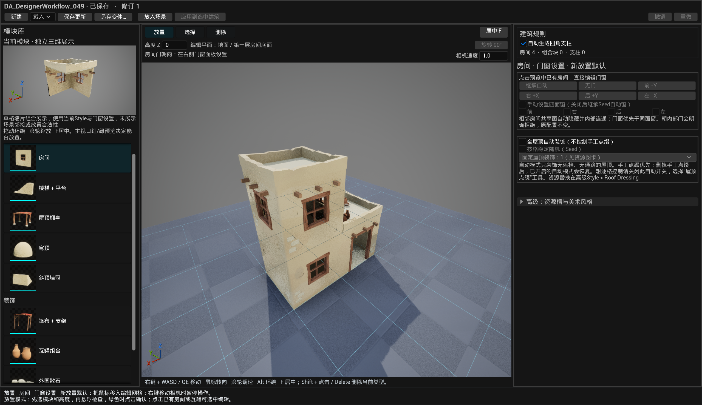
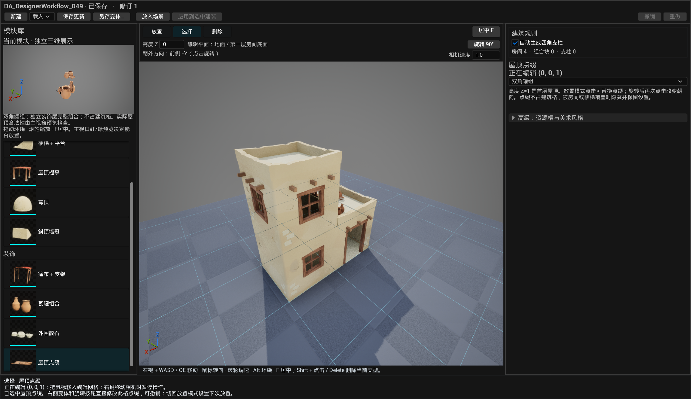
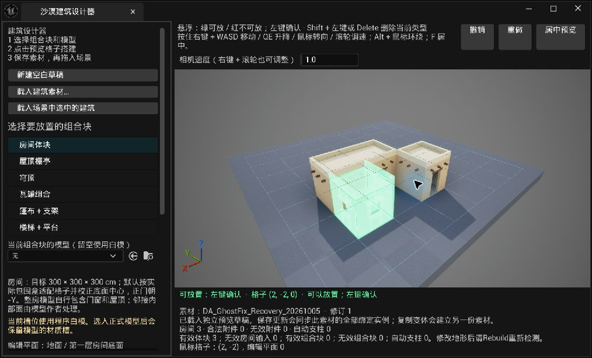
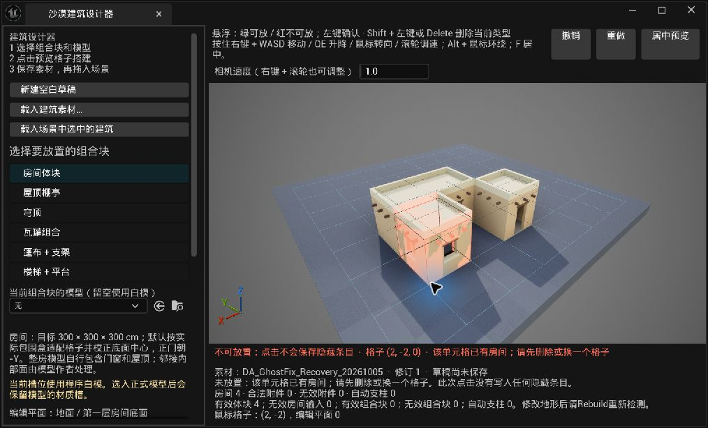

# Desert Building Lab · 沙漠建筑实验室

用于 **Unreal Engine 编辑阶段**的模块化建筑工具。先选择房间、楼梯、篷布、屋顶和装饰组合，在独立三维视口里点击格子搭建，再保存为可重复使用、可继续修改的建筑素材。

这套工具从风格化沙漠建筑的制作需求出发：艺术家负责模块造型与材质，插件负责邻接、承托、通路、占用、保存和实例同步。同一套生成逻辑可以接入不同的模型与材质。

**最初灵感来源：**[Oskar Stålberg](https://oskarstalberg.com/) 的交互房屋实验 [Brick Block](https://oskarstalberg.com/game/house/index.html)（原始 `house` 页面）。本项目受到“点击增减单元格、邻接结果随布局自动更新”的操作方式启发，再针对 Unreal 编辑阶段的场景制作扩展支撑、楼梯、附件和资产管理。当前 Unreal 插件与模块规则由本项目独立编写，公开仓库未移植或收录原作代码与美术资源。

当前版本：`0.4.9-ui.1`。开发与实际编译验证环境：**Unreal Engine 5.8.2 / Windows 64 位**。这是持续迭代的实验工具，当前未建立其他引擎版本兼容矩阵。它属于规则驱动的编辑期 PCG，使用自定义 C++／Slate 设计器，并非 Unreal PCG Graph。

本次累积更新包含相邻楼层楼梯、独立屋顶点缀和上层门槛，以及设计器分区、三种编辑模式和自动支柱恢复。详见[更新记录](Docs/CHANGELOG.md)与[0.4.9 发布说明](Docs/ReleaseNotes_0.4.9-ui.1.md)。连续墙段与 Houdini 仍是评估方向，本次未实施。


上图由公开套件在 Unreal 中实际生成并通过 SceneCapture 渲染。它展示了房间、支撑楼梯、屋顶棚亭、墙冠和篷布组合；不是设计器界面截图。制作该图的脚本见 [Tools/render_example.py](Tools/render_example.py)，不会保存或改写 Unreal 的建筑素材。

## 可以做什么

- 在预览视口里逐格添加房间，按邻接关系生成外墙、门窗、屋顶和女儿墙。
- 添加贴墙直梯、L 形双跑梯、U 形双跑梯，以及完整的“篷布＋支架”组合变体；新楼梯连接相邻楼层表面。
- 放置屋顶棚亭、穹顶、斜顶墙冠、瓦罐组和建筑外围散石组；屋顶点缀的六种配方复用木板与罐组，独立保存、不占建筑格。
- 悬浮时显示候选模型和红／绿放置反馈；无效点击不会存下一件以后突然出现的隐藏模块。
- 检查空间冲突、楼梯通路、屋顶承托和地面支撑；悬空房间可自动生成四角支柱，右栏固定显示开关与恢复入口。
- 用“放置／选择／删除”区分操作；已有附件可原位校验并更改变体、梯型或朝向。
- 为每个房间设置门的朝向、是否有门、四面的窗位；为瓦罐组设置自动靠墙或九方向排布。
- 保存建筑数据、独立风格配置和可拖入场景的蓝图；修改素材时同步关联实例；另存可以创建布局变体。
- 在用户选择的目录下分类收纳模型、材质、材质函数和贴图依赖。
- 输出独立的地基与楼层组件，提供整栋／单层淡化接口，便于连接已有的遮挡检测组件。

## 当前设计器界面

以下两张是 **0.4.9-ui.1、2026-10-09（香港时间）** 的真实 Unreal Slate 界面，由 `FSlateApplication::TakeScreenshot` 捕获。截图证明捕获时的界面状态，不代表物理鼠标逐项验收，也不是 SceneCapture 效果图。



顶栏管理素材与场景操作，左栏选择模块并查看组合预览，中央切换模式与高度，右栏固定显示自动支柱与当前对象参数。



选择模式右栏标明“正在编辑”；切回放置清除选择，设置变为“新放置默认”。步骤见[操作指南](Docs/GettingStarted.md#4-认识界面模式和两个预览)。这两张使用原工程 Art09 美术，木纹等外观可能与公开 ExampleHouse 的自制替代资源不同；本次没有复制或替换美术套件。

## 真实编辑器操作（历史实拍）

以下截图来自 **2026-10-05、插件 0.4.1** 的真实 Unreal 编辑器操作，用来说明“选择模块 → 悬浮检查 → 左键确认”以及冲突反馈。从 `0.4.7-assets.1` 起已增加模块小预览和 `Buildings/Resources` 资源收纳，`0.4.9-ui.1` 又整理了界面分区；图中的旧侧栏、占位美术和保存入口不代表当前界面。上方与文末的公开套件效果图来自 0.4.7 阶段的 SceneCapture 渲染，本次未重新制作样例美术。



2026-10-05 / 0.4.1 历史 UI 实拍：绿色候选表示规则允许放置，点击前可以查看位置；正式生成和临时预览分开处理。



2026-10-05 / 0.4.1 历史 UI 实拍：红色候选与状态文字说明冲突，无效点击不会保存隐藏模块。当前操作步骤以[操作指南](Docs/GettingStarted.md)为准。

## 从哪里开始

| 想做的事 | 文档 |
|---|---|
| 安装插件，做并保存第一栋建筑 | [操作指南](Docs/GettingStarted.md) |
| 理解格子、邻接、支撑和放置校验 | [生成逻辑与代码结构](Docs/GenerationLogic.md) |
| 接入自己的 Blender／Painter 资源 | [模型、材质与槽位接入规范](Docs/AssetIntegration.md) |
| 理解保存目录、共享资源、更新和复制变体 | [资产保存与项目管理](Docs/AssetOrganization.md) |
| 查看版本更新和验证边界 | [更新记录](Docs/CHANGELOG.md) · [0.4.9 发布说明](Docs/ReleaseNotes_0.4.9-ui.1.md) |
| 离线查看整合图文手册 | [公开插件操作手册 HTML](Docs/Manual.html)（下载仓库后用浏览器打开） |
| 确认公开代码与美术文件的使用许可 | [代码许可](LICENSE) · [美术资源许可说明](ASSET_LICENSE.md) · [制作来源与发布范围](Docs/美术来源与发布范围.md) |

## 安装概要

本仓库根目录是一份插件。把它放到项目的以下位置，确保描述文件没有被多套一层目录：

```text
YourProject/
├─ YourProject.uproject
└─ Plugins/
   └─ DesertBuildingLab/
      ├─ DesertBuildingLab.uplugin
      ├─ Source/
      │  ├─ DesertBuildingLab/
      │  └─ DesertBuildingLabEditor/
      └─ Docs/
```

使用源码版需要项目能够编译 C++ 插件。重新生成项目文件、编译项目的 Editor 目标后，在虚幻中启用 **Desert Building Lab**。打开菜单 **工具 → 沙漠建筑工具 → 打开建筑设计器（点击格子搭建）**。完整步骤和无默认美术资源时的配置见[操作指南](Docs/GettingStarted.md)。

仓库同时提供可选的 **ExampleHouse 建筑样例**与可编辑美术源：52 件模型 FBX、31 张自制／AI 辅助 PNG。运行样例使用 106 件 Unreal 资产，包括 Design、Style、BP 和 103 件美术依赖。公开版木纹采用本项目自制贴图，替换了开发环境中比较过的 Adobe 材质；它的木纹外观与私有开发版有所不同。

安装样例时，先关闭编辑器，将仓库的 `Examples/Content/DesertBuildingLabOpenSource` 整个文件夹复制到项目的 `Content/DesertBuildingLabOpenSource`，保留内部包层级和名称。打开项目后，在设计器的 Style 选择器中载入 `DA_ExampleHouse_Style`，或将 `Buildings/ExampleHouse/Blueprints/BP_ExampleHouse` 拖入关卡。样例详细路径见 [Examples/manifest.json](Examples/manifest.json) 和[操作指南](Docs/GettingStarted.md#2-安装可选建筑样例)。它是可选的项目 Content，插件源码没有强绑定这套美术。

仓库中的美术文件以 `ASSET_LICENSE.md` 为准，代码、文档和本项目公开资源按 MIT 许可声明；AI 辅助贴图已标注制作方式。原开发环境中使用过的第三方下载资产不随公开版再分发。也可以使用自己的 `DesertBuildingStyle` 和美术资源。

## 保存后是什么

例如选择 `Content/MyVillage`，命名 `House01`：

```text
MyVillage/
├─ Buildings/House01/
│  ├─ Data/DA_House01
│  ├─ Styles/DA_House01_Style
│  └─ Blueprints/BP_House01
└─ Resources/
   ├─ Meshes/
   ├─ Materials/
   ├─ Textures/
   ├─ MaterialFunctions/
   └─ Other/
```

`DA_House01` 记录制作输入；`DA_House01_Style` 记录模型与材质槽；`BP_House01` 是拖入关卡的可编辑对象。这里保存的建筑仍需要插件的运行时类型。分类收纳不是把整栋建筑合并成一件静态网格。

## 验证范围

| 版本／范围 | 实际检查 |
|---|---|
| 0.4.9-ui.1 本轮 | UE5.8.2 Editor 实际编译成功、源码同步；真实 Slate 设计器 API **168/168**：支柱开关、四角柱链、三模式、原位点缀编辑、草稿撤销边界、保存再载入及真实关卡承托射线；两张原生 Slate 截图 |
| 0.4.8-stairs.1 历史 | 楼梯 **250/250**、门槛 **491/491**、点缀 **128/128**，合计历史 **869** 项；本轮未声明重跑 |
| 0.4.7-assets.1 原开发配置历史 | 保存流程 **264/264**：分类目录、引用、材质替换、同根复用、跨根复制、冲突拒绝、旧数据、保存重开与实例同步 |
| 0.4.7-assets.1 公开 ExampleHouse 历史 | **204/204** 项示例生成与资源检查；103件美术依赖、30张实际使用贴图、六张自制木材替代、导入记录和私有路径检查；本次未重新生成样例 |

[本次验证摘要与源码哈希](Docs/Verification_0.4.9-ui.1.json)。不同版本数字不能相加称为本轮全流程测试。Slate API不是物理鼠标操作；保存再载入不等于磁盘卸载／编辑器重启；原生射线与胶囊扫描不等于实际角色行走。

未验证新项目完整接入、PIE CharacterMovement、NavMesh、最终游戏打包、性能、其他引擎版本及最终美术接受。换用资源后仍需检查拼接、洞口、碰撞与楼梯，详细边界见[发布说明](Docs/ReleaseNotes_0.4.9-ui.1.md)。

## 开发结构

- `Source/DesertBuildingLab`：建筑数据、规则、实例组件、分层和淡化接口。
- `Source/DesertBuildingLabEditor`：Slate 设计器、预览、撤销、资产收纳、蓝图保存和关卡同步。
- `Examples/Content/DesertBuildingLabOpenSource`：可选的 Unreal 建筑样例与完整风格配置。
- `SourceArt`：本项目模型 FBX 和贴图源，以及文件清单。
- `Docs`：操作、逻辑和美术接入说明。


四种棚架使用同一套红金布料材质，由模型轮廓、布面松垂和前沿形状区分。模型与材质可替换，放置规则保持由插件处理。

提交问题时，请提供引擎版本、使用的模块、操作步骤、截图，以及界面下方的规则提示。修改规则时，优先让悬浮预览和确认放置继续共用同一套求解结果；修改美术时，优先保护模块连接面和洞口净尺寸。
